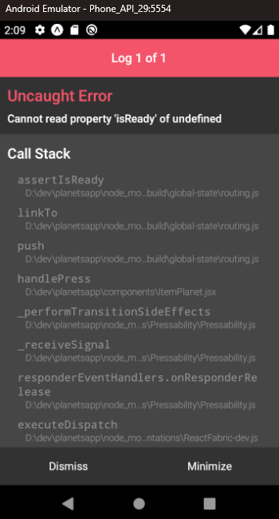

# PlanetsApp

**PlanetsApp** es una aplicación móvil desarrollada con **React Native** y **Expo** que permite a los usuarios explorar información sobre diferentes planetas y marcar sus favoritos. La aplicación utiliza `AsyncStorage` para almacenar los planetas favoritos localmente.

## Características

- Visualización de planetas con detalles como temperatura, gravedad, densidad, radio, masa y órbita sideral.
- Posibilidad de marcar planetas como favoritos.
- Navegación entre pestañas para ver todos los planetas y solo los favoritos.
- Animaciones atractivas usando Lottie.

## APIs utilizadas

- **Datos de los planetas:** [le-systeme-solaire.net](https://api.le-systeme-solaire.net/rest/bodies?filter[]=isPlanet,eq,true)
- **Imágenes de los planetas:** [Wikipedia REST API](https://en.wikipedia.org/api/rest_v1/page/summary/)

> La API de los planetas no proporciona imágenes, por lo que se utiliza la API de Wikipedia para obtenerlas.

## Instalación

Para ejecutar este proyecto localmente, sigue los siguientes pasos:

```bash
npm install       # Instala las dependencias
npm start         # Inicia la aplicación con Expo
```

> Asegúrate de tener instalado Expo CLI (`npm install -g expo-cli`).

## Errores conocidos

### ❗ Redirección desde la tarjeta del planeta

Hay un problema al redirigir desde la tarjeta del planeta. Puedes ver una captura del error aquí:


